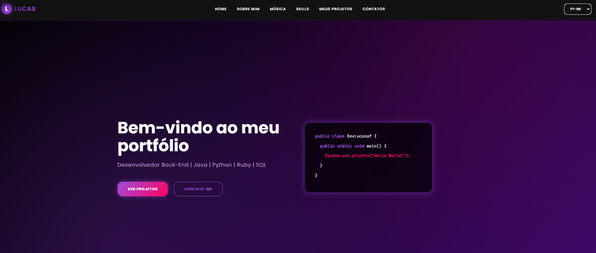

# Portifólio



<table align="right">
    <tr>
        <td>
            <a href="https://github.com/devlucasaf/Portifolio/README.md">
                 
                English
            </a>
        </td>
    </tr>
    <tr>
        <td>
            <a href="https://github.com/devlucasaf/Portifolio/README-ing-us.md">
                  
                Português
            </a>
        </td>
    </tr>
</table>

# 💻 Sobre

Project created with the purpose of introducing myself as a back-end developer.

# 🗃️ Structure

```
/portfolio
  ├── index.html
  ├── css/
  │   └── style.css
  ├── js/
  │   ├── translations.js
  │   └── script.js
  └── assets/
      ├── flags/
      │   ├── br_flag.png
      │   └── us_flag.png
      └── icons/
          ├── python-icon.png
          ├── java-icon.png
          ├── ruby-icon.png
          ├── sql-icon.png
          ├── html-icon.png
          ├── css-icon.png
          ├── javascript-icon.png
          ├── pycharm-icon.png
          ├── intellij-icon.png
          ├── rubymine-icon.png
          ├── vs-icon.png
          ├── visual-studio-icon.png
          ├── pgadmin4-icon.png
          ├── git-icon.png
          ├── github-icon.png
          └── lucas-freitas-foto.jpeg
```

# 🤯 Site Composition

- **Home:** My introduction/presentation.
- **About Me:** A brief overview of who I am and my career path.
- **Skills:** Languages and tools that I use.
- **My Projects:** Some of my recently developed projects.
- **Contacts:** My social networks and ways to get in touch with me.

# 🛠️ Technologies used

<div align="left">
    
    
    
    
    
</div>

## 🏆 Licença

The [MIT License](./LICENSE).

