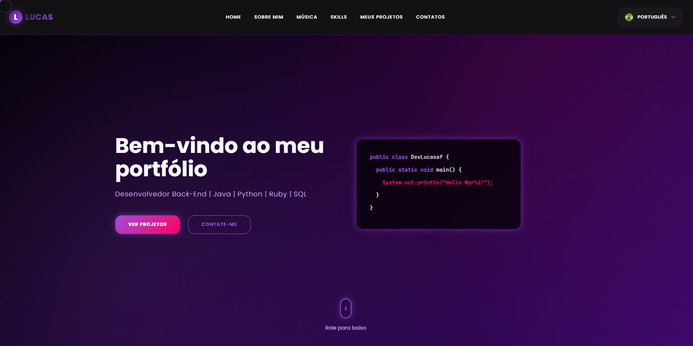

<div align="right">
    <a href="README.md">
        
        English
    </a>
    | 
    <a href="README-pt-br.md">
        
        Português
    </a>
</div>

# Portifólio



# 💻 Sobre

Projeto feito no intuito de me apresentar, como desenvolvedor back-end.

# 🗃️ Estrutura

```
/Portifolio
  ├── index.html
  ├── css/
  │   └── style.css
  ├── js/
  │   ├── translations.js
  │   └── script.js
  └── assets/
	  ├── lucas-freitas-foto.jpeg
      ├── flags/
      │   ├── br_flag.png
      │   └── us_flag.png
      └── icons/
          ├── python-icon.png
          ├── java-icon.png
          ├── ruby-icon.png
          ├── sql-icon.png
          ├── html-icon.png
          ├── css-icon.png
          ├── javascript-icon.png
          ├── pycharm-icon.png
          ├── intellij-icon.png
          ├── rubymine-icon.png
          ├── vs-icon.png
          ├── visual-studio-icon.png
          ├── pgadmin4-icon.png
          ├── github-icon.png
          └── git-icon.png
```

# 🤯 Composição do site

- **Home:** Minha apresentação.
- **Sobre mim:** abordo uma pequena apresentação sobre mim e a minha trajetória.
- **Skills:** liguagens e ferramentas que eu utilizo.
- **Meus Projetos:** alguns projetos desenvolvidos recentemente por mim.
- **Contatos:** minhas redes sociais e formas de entrar em contato comigo.

# 🛠️ Tecnologias utilizadas

<div align="left">
    
    
    
    
    
</div>

## 🏆 Licença

The [MIT License](./LICENSE).


